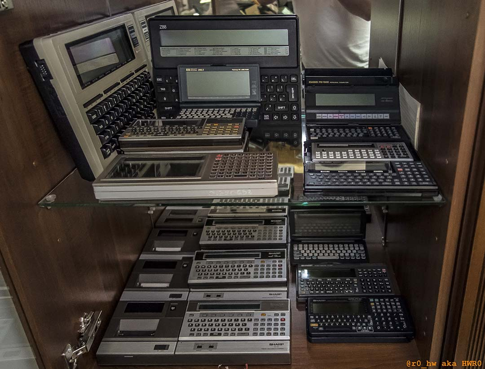

# PocketComputerTools
Tools for our beloved Sharp and Casio (others too) Pocket Computers from the 80' and '90

 

- <a href="https://github.com/hwreverse/PocketComputerTools/tree/master/bmp2hex">bmp2hex:</a> Converts a BMP file 8 row by 8 rows into 8 Bit GPrint HEX Sequences for Sharp PC-1500 / PC-1600 / E500 / G850 / G850V/VS,  aswell as for Casio PB-1000 (DEFCHR$), PB-2000C, and many others

 

My Vintage collection 15 months ago :

